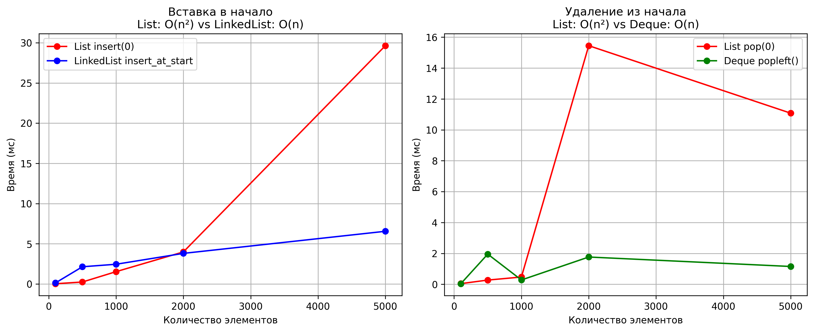

# Лабораторная работа 02: Основные структуры данных

## Цель работы
Изучить понятие и особенности базовых абстрактных типов данных (стек, очередь, дек, связный список) и их реализаций в Python. Научиться выбирать оптимальную структуру данных для решения конкретной задачи, основываясь на анализе теоретической и практической сложности операций.

## Теоретическая часть

### Связный список
- **Вставка в начало**: O(1)
- **Вставка в конец**: O(1) с tail-указателем
- **Удаление из начала**: O(1)
- **Поиск элемента**: O(n)

### Сравнение структур данных
- **list.insert(0, item)**: O(n)
- **LinkedList.insert_at_start()**: O(1)
- **list.pop(0)**: O(n)
- **deque.popleft()**: O(1)

## Практическая реализация

### 1. Связный список
Реализован класс `LinkedList` с методами:
- `insert_at_start()` - O(1)
- `insert_at_end()` - O(1)
- `delete_from_start()` - O(1)
- `traversal()` - O(n)
- `search()` - O(n)

### 2. Анализ производительности
Проведено сравнение:
- list vs LinkedList для вставки в начало
- list vs deque для операций очереди

### 3. Решение задач
Решены 3 практические задачи:
1. **Проверка сбалансированности скобок** - использование стека
2. **Проверка палиндрома** - использование дека
3. **Симуляция очереди печати** - использование deque

## Результаты

### Графики производительности


### Ключевые выводы
1. LinkedList значительно эффективнее для частых вставок в начало
2. deque оптимален для реализации очереди
3. list эффективен для случайного доступа, но не для операций с началом

## Характеристики ПК для тестирования
- Процессор: Intel Core i7-1075GH @ 2.60GHz
- Оперативная память: 16 GB DDR4
- OC: Windows 11
- Python: 3.9.7

## Запуск
```bash
python performance_analysis.py
python task_solutions.py