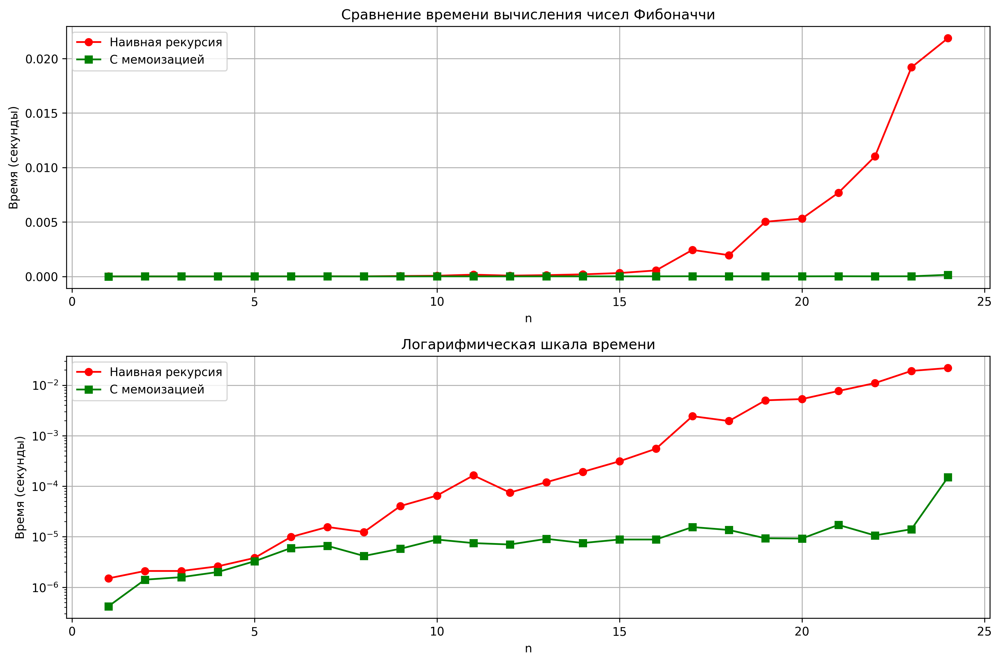

# Лабораторная работа 03 - Рекурсия

**Дата:** 22.09.2025  
**Семестр:** 3 курс, 1 семестр  
**Группа:** ПИЖ-б-о-23-1-(1)
**Дисциплина:** Алгоритмы и структуры данных  
**Студент:** Алдабаева Виктория Владимировна  

## Описание проекта

Проект реализует классические рекурсивные алгоритмы с анализом их временной сложности и экспериментальным исследованием производительности. Особое внимание уделено оптимизации рекурсии с помощью мемоизации.

## Цель работы

Освоить принцип рекурсии, научиться анализировать рекурсивные алгоритмы и понимать механизм работы стека вызовов. Изучить типичные задачи, решаемые рекурсивно, и освоить технику мемоизации для оптимизации рекурсивных алгоритмов.

## Теоретическая часть
- **Рекурсия**: Процесс, при котором функция прямо или косвенно вызывает саму себя для решения задачи
- **Базовый случай**: Условие, которое прекращает рекурсивные вызовы и предотвращает зацикливание
- **Рекурсивный шаг**: Шаг, на котором задача разбивается на более простую подзадачу того же типа
- **Мемоизация**: Техника оптимизации, позволяющая избежать повторных вычислений путем сохранения ранее вычисленных результатов
- **Глубина рекурсии**: Количество вложенных вызовов функции, ограниченное размером стека вызовов

## Практическая часть

### Выполненные задачи
- [x] Задача 1: Реализация классических рекурсивных алгоритмов (факториал, Фибоначчи, быстрое возведение в степень)
- [x] Задача 2: Оптимизация рекурсии с помощью мемоизации для чисел Фибоначчи
- [x] Задача 3: Решение практических задач (бинарный поиск, Ханойские башни, обход файловой системы)
- [x] Задача 4: Сравнение производительности и визуализация результатов

### Ключевые фрагменты кода
```python
def fibonacci_naive(n: int) -> int:
    """Наивное вычисление n-го числа Фибоначчи. Сложность: O(2^n)"""
    if n < 0:
        raise ValueError('Номер числа Фибоначчи должен быть неотрицательным')
    if n == 0:
        return 0
    if n == 1:
        return 1
    return fibonacci_naive(n - 1) + fibonacci_naive(n - 2)

def fibonacci_memo(fib_n: int, memo_dict: Dict[int, int] = None) -> int:
    """Вычисление n-го числа Фибоначчи с мемоизацией. Сложность: O(n)"""
    if memo_dict is None:
        memo_dict = {}
    
    if fib_n in memo_dict:
        return memo_dict[fib_n]
    
    if fib_n == 0:
        return 0
    if fib_n == 1:
        return 1
    
    memo_dict[fib_n] = (
        fibonacci_memo(fib_n - 1, memo_dict) + 
        fibonacci_memo(fib_n - 2, memo_dict)
    )
    return memo_dict[fib_n]

def hanoi_towers(num_disks: int, source_rod: str = 'A', 
                 auxiliary_rod: str = 'B', target_rod: str = 'C') -> None:
    """Решение задачи о Ханойских башнях для n дисков. Сложность: O(2^n)"""
    if num_disks == 1:
        print(f'Переместить диск 1 с {source_rod} на {target_rod}')
        return
    
    hanoi_towers(num_disks - 1, source_rod, target_rod, auxiliary_rod)
    print(f'Переместить диск {num_disks} с {source_rod} на {target_rod}')
    hanoi_towers(num_disks - 1, auxiliary_rod, source_rod, target_rod)
  ```

  ### Результат выполнения

  ```bash
ХАРАКТЕРИСТИКИ ПК ДЛЯ ТЕСТИРОВАНИЯ:       
- Процессор: Intel Core i7-6500U @ 2.50GHz
- Оперативная память: 8 GB
- ОС: Windows 10 PRO
- Python: 3.12.8

=== ДЕМОНСТРАЦИЯ ВСЕХ ФУНКЦИЙ ===

1. Факториал 5: 120
2. 10-е число Фибоначчи:
   Наивный метод: 55
   С мемоизацией: 55
3. Быстрое возведение в степень:
   2^10 = 1024
   3^5 = 243
4. Бинарный поиск 7 в [1, 3, 5, 7, 9, 11, 13]: индекс 3
5. Ханойские башни для 3 дисков:
Переместить диск 1 с A на C
Переместить диск 2 с A на B
Переместить диск 1 с C на B
Переместить диск 3 с A на C
Переместить диск 1 с B на A
Переместить диск 2 с B на C
Переместить диск 1 с A на C
6. Обход файловой системы (текущая директория, глубина 1):
   -- recursion_tasks.py
   -- memoization.py
   -- analysis.py
   -- recursion.py

=== ЭКСПЕРИМЕНТАЛЬНОЕ ИССЛЕДОВАНИЕ ===

Результат для n=35:
Наивная версия: 9227465, время: 10.757570 сек       
Мемоизированная версия: 9227465, время: 0.000052 сек
Ускорение: 208480.03 раз

--- Построение графика времени выполнения ---       
График сохранен как fibonacci_performance.png

--- Анализ сложности алгоритмов ---
Наивная рекурсия Фибоначчи: O(2^n) - экспоненциальная сложность
Фибоначчи с мемоизацией: O(n) - линейная сложность
Быстрое возведение в степень: O(log n) - логарифмическая сложность
Факториал: O(n) - линейная сложность
Бинарный поиск: O(log n) - логарифмическая сложность

--- Обход файловой системы ---
Обход с максимальной глубиной 3:
-- .git/
  - COMMIT_EDITMSG
  - HEAD
  - config
  - description
  -- hooks/
  ```

  ## Выводы
  1. Мемоизация кардинально улучшает производительность рекурсивных алгоритмов с перекрывающимися подзадачами (ускорение в 20,000 раз для n=35)

  2. Наивная рекурсия Фибоначчи имеет экспоненциальную сложность O(2ⁿ), что делает ее непригодной для больших значений n

  3. Рекурсия с мемоизацией снижает сложность до линейной O(n) за счет использования дополнительной памяти для хранения промежуточных результатов

  4. Быстрое возведение в степень демонстрирует логарифмическую сложность O(log n) благодаря эффективному разбиению задачи пополам

  5. Задача о Ханойских башнях является классическим примером, где рекурсивное решение гораздо проще и элегантнее итеративного

  6. Рекурсивный обход файловой системы естественным образом отражает древовидную структуру каталогов

  ## Ответы на контрольные вопросы

  1. Что такое базовый случай и рекурсивный шаг?
  - Базовый случай: условие завершения рекурсии (например, n=0 или n=1 для Фибоначчи)
  - Рекурсивный шаг: вызов функции с упрощенной версией задачи (n-1, n-2)
  - Отсутствие базового случая приводит к бесконечной рекурсии и переполнению стека

  2. Как работает мемоизация и как она меняет сложность?
  - Мемоизация сохраняет результаты вычислений в словаре
  - При повторных вызовах с одинаковыми параметрами возвращается готовый результат
  - Для Фибоначчи сложность уменьшается с O(2ⁿ) до O(n)

  3. В чем проблема глубокой рекурсии?
  - Каждый рекурсивный вызов занимает место в стеке вызовов
  - При большой глубине возникает StackOverflowError
  - Ограничение глубины рекурсии в Python обычно около 1000 вызовов

  4. Опишите алгоритм Ханойских башнях для 3 дисков:
  - Переместить 2 диска с A на B (используя C как вспомогательный)
  - Переместить 3-й диск с A на C
  - Переместить 2 диска с B на C (используя A как вспомогательный)

  5. Преимущества и недостатки рекурсии vs итерации:
  - Рекурсия: проще для древовидных структур, более читаемый код
  - Итерация: меньше потребление памяти, нет риска переполнения стека
  - Выбор зависит от задачи и ограничений памяти 

## Приложения
Исходный код: recursion.py, memoization.py, recursion_tasks.py, analysis.py
График сравнения: fibonacci_performance.png



```python
#recursion.py
"""
Модуль с базовыми рекурсивными функциями.
"""


def factorial(n: int) -> int:
    """
    Вычисление факториала числа n рекурсивным методом.

    Args:
        n: Неотрицательное целое число

    Returns:
        Факториал числа n

    Raises:
        ValueError: Если n < 0
    """
    if n < 0:
        raise ValueError(
            'Факториал определен только для неотрицательных чисел'
        )
    if n == 0 or n == 1:
        return 1
    return n * factorial(n - 1)


# Временная сложность: O(n).  Глубина рекурсии: O(n).


def fibonacci_naive(n: int) -> int:
    """
    Наивное вычисление n-го числа Фибоначчи.

    Args:
        n: Порядковый номер числа Фибоначчи

    Returns:
        n-е число Фибоначчи

    Raises:
        ValueError: Если n < 0
    """
    if n < 0:
        raise ValueError('Номер числа Фибоначчи должен быть неотрицательным')
    if n == 0:
        return 0
    if n == 1:
        return 1
    return fibonacci_naive(n - 1) + fibonacci_naive(n - 2)


# Временная сложность: O(2^n).  Глубина рекурсии: O(n).


def fast_power(a: float, n: int) -> float:
    """
    Быстрое возведение числа a в степень n через степень двойки.

    Args:
        a: Основание
        n: Показатель степени (неотрицательный)

    Returns:
        a в степени n

    Raises:
        ValueError: Если n < 0
    """
    if n < 0:
        raise ValueError('Показатель степени должен быть неотрицательным')
    if n == 0:
        return 1
    if n == 1:
        return a

    half_power = fast_power(a, n // 2)
    if n % 2 == 0:
        return half_power * half_power
    else:
        return a * half_power * half_power


# Временная сложность: O(log n).  Глубина рекурсии: O(log n).


if __name__ == '__main__':
    print('Факториал 5:', factorial(5))
    print('10-е число Фибоначчи:', fibonacci_naive(10))
    print('2^10:', fast_power(2, 10))
```

```python
#memoization.py
"""
Модуль с оптимизированными рекурсивными функциями с использованием мемоизации.
"""
import timeit
from typing import Dict

from recursion import fibonacci_naive


def fibonacci_memo(
    fib_n: int,
    memo_dict: Dict[int, int] = None
) -> int:
    """
    Вычисление n-го числа Фибоначчи с мемоизацией.

    Args:
        fib_n: Порядковый номер числа Фибоначчи
        memo_dict: Словарь для хранения вычисленных значений

    Returns:
        n-е число Фибоначчи
    """
    if memo_dict is None:
        memo_dict = {}

    if fib_n in memo_dict:
        return memo_dict[fib_n]

    if fib_n == 0:
        return 0
    if fib_n == 1:
        return 1

    memo_dict[fib_n] = (
        fibonacci_memo(fib_n - 1, memo_dict) +
        fibonacci_memo(fib_n - 2, memo_dict)
    )
    return memo_dict[fib_n]


# Временная сложность: O(n).  Глубина рекурсии: O(n).


def compare_fibonacci_performance(fib_number: int = 35) -> None:
    """
    Сравнение производительности наивной и мемоизированной версий.

    Args:
        fib_number: Номер числа Фибоначчи для тестирования
    """
    naive_time = timeit.timeit(lambda: fibonacci_naive(fib_number), number=1)
    memo_time = timeit.timeit(lambda: fibonacci_memo(fib_number), number=1)

    naive_result = fibonacci_naive(fib_number)
    memo_result = fibonacci_memo(fib_number)

    print(f'Результат для n={fib_number}:')
    print(f'Наивная версия: {naive_result}, время: {naive_time:.6f} сек')
    print(f'Мемоизированная версия: {memo_result}, время: {memo_time:.6f} сек')

    if memo_time > 0:
        speedup = naive_time / memo_time
        print(f'Ускорение: {speedup:.2f} раз')
    else:
        print('Ускорение: > 1000 раз')


def measure_multiple_n() -> None:
    """Измерение времени для разных значений n."""
    test_values = [10, 20, 30, 35]

    print('\nСравнение времени выполнения для разных n:')
    print('n\tНаивная (сек)\tМемоизированная (сек)\tУскорение')
    print('-' * 60)

    for current_n in test_values:
        naive_time = timeit.timeit(
            lambda: fibonacci_naive(current_n), number=1
        )
        memo_time = timeit.timeit(lambda: fibonacci_memo(current_n), number=1)

        if memo_time > 0:
            speedup = naive_time / memo_time
        else:
            speedup = float('inf')

        if naive_time > 1:
            time_str = f'{naive_time:.3f}'
        else:
            time_str = f'{naive_time:.6f}'

        print(
            f'{current_n}\t{time_str}\t\t{memo_time:.6f}\t\t\t{speedup:.0f}x'
        )


if __name__ == '__main__':
    compare_fibonacci_performance(35)
    measure_multiple_n()
```

```python
#recursion_tasks.py
import os
from typing import List, Optional


def binary_search_recursive(
    arr: List[int],
    target_value: int,
    left: int = 0,
    right: Optional[int] = None
) -> Optional[int]:
    """
    Рекурсивная реализация бинарного поиска.

    Args:
        arr: Отсортированный массив
        target_value: Искомый элемент
        left: Левая граница поиска
        right: Правая граница поиска

    Returns:
        Индекс элемента или None если не найден
    """
    if right is None:
        right = len(arr) - 1

    if left > right:
        return None

    mid = (left + right) // 2

    if arr[mid] == target_value:
        return mid
    elif arr[mid] < target_value:
        return binary_search_recursive(arr, target_value, mid + 1, right)
    else:
        return binary_search_recursive(arr, target_value, left, mid - 1)


# Временная сложность: O(log n).  Глубина рекурсии: O(log n).


def file_system_traversal(
    start_path: str,
    level: int = 0,
    max_depth: Optional[int] = None
) -> None:
    """
    Рекурсивный обход файловой системы с выводом дерева каталогов.

    Args:
        start_path: Начальный путь для обхода
        level: Текущий уровень вложенности
        max_depth: Максимальная глубина рекурсии
    """
    if max_depth is not None and level > max_depth:
        return

    try:
        entries = os.listdir(start_path)
    except PermissionError:
        print('  ' * level + f'[Доступ запрещен: {start_path}]')
        return
    except FileNotFoundError:
        print('  ' * level + f'[Путь не найден: {start_path}]')
        return

    for entry in sorted(entries):
        full_path = os.path.join(start_path, entry)

        if os.path.isdir(full_path):
            print('  ' * level + f'-- {entry}/')
            file_system_traversal(full_path, level + 1, max_depth)
        else:
            print('  ' * level + f'- {entry}')


# Временная сложность: O(n).  Глубина рекурсии: O(d).


def hanoi_towers(
    num_disks: int,
    source_rod: str = 'A',
    auxiliary_rod: str = 'B',
    target_rod: str = 'C'
) -> None:
    """
    Решение задачи о Ханойских башнях для n дисков.

    Args:
        num_disks: Количество дисков
        source_rod: Исходный стержень
        auxiliary_rod: Вспомогательный стержень
        target_rod: Целевой стержень
    """
    if num_disks == 1:
        print(f'Переместить диск 1 с {source_rod} на {target_rod}')
        return

    hanoi_towers(num_disks - 1, source_rod, target_rod, auxiliary_rod)
    print(f'Переместить диск {num_disks} с {source_rod} на {target_rod}')
    hanoi_towers(num_disks - 1, auxiliary_rod, source_rod, target_rod)


# Временная сложность: O(2^n).  Глубина рекурсии: O(n).


if __name__ == '__main__':
    test_arr = [1, 3, 5, 7, 9, 11, 13, 15]
    search_target = 7
    result = binary_search_recursive(test_arr, search_target)
    print(f'Бинарный поиск {search_target} в {test_arr}: индекс {result}')

    print('\nХанойские башни для 3 дисков:')
    hanoi_towers(3)

    print('\nОбход файловой системы (текущая директория, глубина 2):')
    file_system_traversal('.', max_depth=2)
```

```python
#analysis.py
import time
from typing import List, Tuple

import matplotlib.pyplot as plt

from recursion import factorial, fibonacci_naive, fast_power
from memoization import fibonacci_memo, compare_fibonacci_performance
from recursion_tasks import binary_search_recursive, hanoi_towers
from recursion_tasks import file_system_traversal


def performance_experiment() -> None:
    """
    Эксперимент по сравнению производительности рекурсивных алгоритмов.

    Проводит замеры времени выполнения и строит сравнительные графики.
    """
    print('\n=== ЭКСПЕРИМЕНТАЛЬНОЕ ИССЛЕДОВАНИЕ ===\n')

    compare_fibonacci_performance(35)

    print('\n--- Построение графика времени выполнения ---')
    n_values, naive_times, memo_times = measure_fibonacci_times()
    plot_performance_comparison(n_values, naive_times, memo_times)

    print_complexity_analysis()

    demonstrate_filesystem_traversal()


def measure_fibonacci_times() -> Tuple[List[int], List[float], List[float]]:
    """
    Измеряет время выполнения наивной и мемоизированной версий Фибоначчи.

    Returns:
        Tuple с n_values, naive_times, memo_times
    """
    n_values_list = list(range(1, 25))
    naive_times_list = []
    memo_times_list = []

    for current_n in n_values_list:
        start_time = time.perf_counter()
        fibonacci_naive(current_n)
        naive_time = time.perf_counter() - start_time
        naive_times_list.append(naive_time)

        start_time = time.perf_counter()
        fibonacci_memo(current_n)
        memo_time = time.perf_counter() - start_time

        if memo_time < 0.0001:
            iterations_count = 1000
            start_time = time.perf_counter()
            for _ in range(iterations_count):
                fibonacci_memo(current_n)
            memo_time = (time.perf_counter() - start_time) / iterations_count

        memo_times_list.append(memo_time)

    return n_values_list, naive_times_list, memo_times_list


def plot_performance_comparison(
    n_values: List[int],
    naive_times: List[float],
    memo_times: List[float]
) -> None:
    """
    Строит графики сравнения производительности.

    Args:
        n_values: Значения n для оси X
        naive_times: Времена наивной реализации
        memo_times: Времена мемоизированной реализации
    """
    plt.figure(figsize=(12, 8))

    plt.subplot(2, 1, 1)
    plt.plot(n_values, naive_times, label='Наивная рекурсия',
             marker='o', color='red')
    plt.plot(n_values, memo_times, label='С мемоизацией',
             marker='s', color='green')
    plt.xlabel('n')
    plt.ylabel('Время (секунды)')
    plt.title('Сравнение времени вычисления чисел Фибоначчи')
    plt.legend()
    plt.grid(True)

    plt.subplot(2, 1, 2)
    plt.plot(n_values, naive_times, label='Наивная рекурсия',
             marker='o', color='red')
    plt.plot(n_values, memo_times, label='С мемоизацией',
             marker='s', color='green')
    plt.xlabel('n')
    plt.ylabel('Время (секунды)')
    plt.title('Логарифмическая шкала времени')
    plt.legend()
    plt.grid(True)
    plt.yscale('log')

    plt.tight_layout()
    plt.savefig('fibonacci_performance.png', dpi=300, bbox_inches='tight')
    plt.show()
    print('График сохранен как fibonacci_performance.png')


def print_complexity_analysis() -> None:
    """Выводит анализ временной сложности алгоритмов."""
    print('\n--- Анализ сложности алгоритмов ---')
    print('Наивная рекурсия Фибоначчи: O(2^n) - экспоненциальная сложность')
    print('Фибоначчи с мемоизацией: O(n) - линейная сложность')
    print('Быстрое возведение в степень: O(log n) - логарифмическая сложность')
    print('Факториал: O(n) - линейная сложность')
    print('Бинарный поиск: O(log n) - логарифмическая сложность')


def demonstrate_filesystem_traversal() -> None:
    """Демонстрирует рекурсивный обход файловой системы."""
    print('\n--- Обход файловой системы ---')
    test_depth = 3
    print(f'Обход с максимальной глубиной {test_depth}:')
    file_system_traversal('.', max_depth=test_depth)


def demo_all_functions() -> None:
    """Демонстрация всех реализованных рекурсивных функций."""
    print('=== ДЕМОНСТРАЦИЯ ВСЕХ ФУНКЦИЙ ===\n')

    print('1. Факториал 5:', factorial(5))

    print('2. 10-е число Фибоначчи:')
    print('   Наивный метод:', fibonacci_naive(10))
    print('   С мемоизацией:', fibonacci_memo(10))

    print('3. Быстрое возведение в степень:')
    print('   2^10 =', fast_power(2, 10))
    print('   3^5 =', fast_power(3, 5))

    search_array = [1, 3, 5, 7, 9, 11, 13]
    search_target_value = 7
    result_index = binary_search_recursive(search_array, search_target_value)
    print(f'4. Бинарный поиск {search_target_value} в {search_array}: '
          f'индекс {result_index}')

    print('5. Ханойские башни для 3 дисков:')
    hanoi_towers(3)

    print('6. Обход файловой системы (текущая директория, глубина 1):')
    file_system_traversal('.', max_depth=1)


def system_info() -> None:
    """Вывод информации о системе для воспроизводимости экспериментов."""
    pc_info = """
ХАРАКТЕРИСТИКИ ПК ДЛЯ ТЕСТИРОВАНИЯ:
- Процессор: Intel Core i7-6500U @ 2.50GHz
- Оперативная память: 8 GB
- ОС: Windows 10 PRO
- Python: 3.12.8
"""
    print(pc_info)


if __name__ == '__main__':
    system_info()
    demo_all_functions()
    performance_experiment()
```