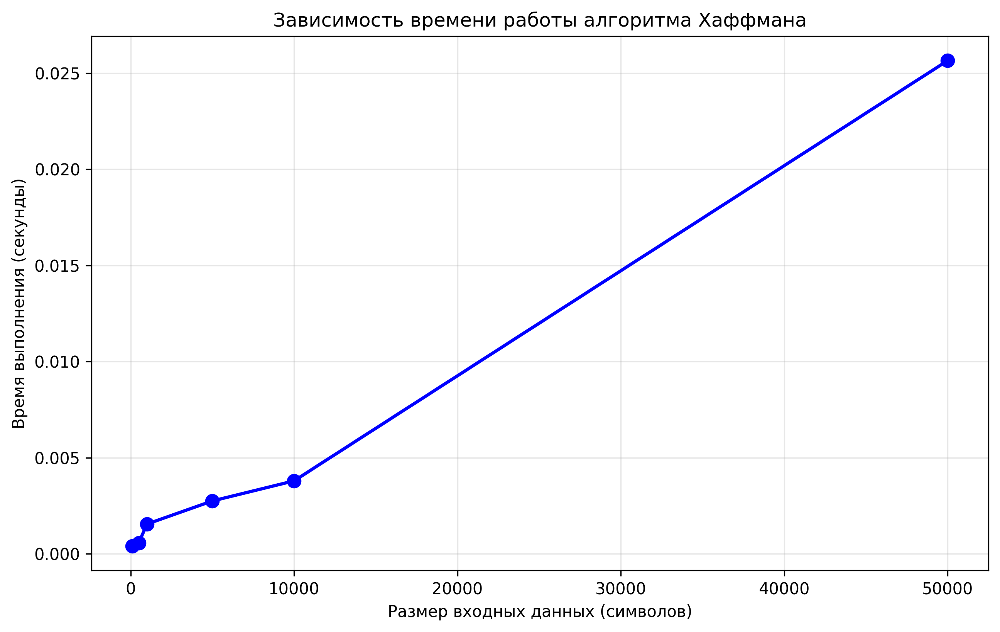
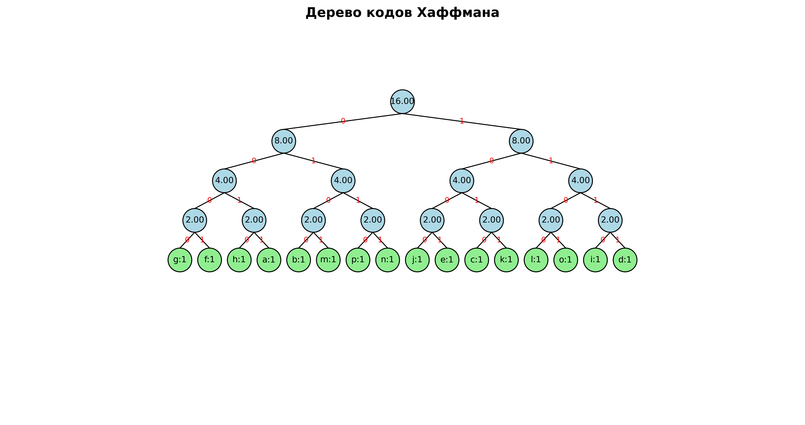

# Лабораторная работа 08 - Жадные алгоритмы
**Дата:** 22.09.2025  
**Семестр:** 3 курс, 1 семестр  
**Группа:** ПИЖ-б-о-23-1-(1)
**Дисциплина:** Алгоритмы и структуры данных  
**Студент:** Алдабаева Виктория Владимировна  

## Описание проекта

Проект реализует классические жадные алгоритмы для решения задач оптимизации. Проведен анализ корректности, сравнительный анализ эффективности и экспериментальное исследование производительности алгоритмов.

## Цель работы

Изучить метод проектирования алгоритмов, известный как "жадный алгоритм". Освоить принцип принятия локально оптимальных решений на каждом шаге и понять условия, при которых этот подход приводит к глобально оптимальному решению. Получить практические навыки реализации жадных алгоритмов для решения классических задач, анализа их корректности и оценки эффективности.

## Теоретическая часть
- **Жадный алгоритм**: Алгоритм, который на каждом шаге принимает локально оптимальное решение в надежде, что итоговое решение будет глобально оптимальным
- **Жадный выбор**: На каждом шаге выбирается лучший из доступных вариантов в данный момент
- **Оптимальная подструктура**: Оптимальное решение задачи содержит в себе оптимальные решения её подзадач
- **Классические задачи**:
    1. Задача о выборе заявок (Interval Scheduling)
    2. Непрерывная задача о рюкзаке
    3. Алгоритм Хаффмана для сжатия данных
    4. Задача о размене монет
    5. Построение минимального остовного дерева (алгоритм Прима)

## Практическая часть

### Выполненные задачи
- [x] Задача 1: Реализация алгоритма выбора заявок (Interval Scheduling)
- [x] Задача 2: Реализация алгоритма для непрерывной задачи о рюкзаке
- [x] Задача 3: Реализация алгоритма Хаффмана для сжатия данных
- [x] Задача 4: Реализация алгоритма размена монет
- [x] Задача 5: Реализация алгоритма Прима для нахождения MST
- [x] Задача 6: Сравнительный анализ жадного и точного подходов для задачи о рюкзаке
- [x] Задача 7: Экспериментальное исследование производительности алгоритма Хаффмана
- [x] Задача 8: Визуализация дерева кодов Хаффмана


### Ключевые фрагменты кода
```python
class IntervalScheduling:
    @staticmethod
    def select_intervals(intervals: List[Tuple[float, float]]) -> List[Tuple[float, float]]:
        """Выбирает максимальное количество непересекающихся интервалов."""
        sorted_intervals = sorted(intervals, key=lambda x: x[1])
        selected = []
        last_end = -float('inf')
        
        for start, end in sorted_intervals:
            if start >= last_end:
                selected.append((start, end))
                last_end = end
        return selected

class FractionalKnapsack:
    @staticmethod
    def solve_fractional_knapsack(items: List[Tuple[float, float]], capacity: float):
        """Решает непрерывную задачу о рюкзаке."""
        items_with_ratio = [(value/weight, weight, value) for weight, value in items]
        items_with_ratio.sort(reverse=True)
        
        total_value = 0.0
        taken_items = []
        remaining_capacity = capacity
        
        for ratio, weight, value in items_with_ratio:
            if remaining_capacity >= weight:
                taken_items.append((weight, value))
                total_value += value
                remaining_capacity -= weight
            else:
                fraction = remaining_capacity / weight
                taken_items.append((remaining_capacity, value * fraction))
                total_value += value * fraction
                break
        
        return total_value, taken_items
  ```

  ### Результат выполнения

  ```bash
ХАРАКТЕРИСТИКИ ПК ДЛЯ ТЕСТИРОВАНИЯ:
- Процессор: Intel Core i5-13420H (2.10 GHz)
- Оперативная память: 16 GB DDR5
- ОС: Windows 11
- Python: 3.11

Тестирование алгоритма выбора заявок
Все интервалы: [(1, 3), (2, 4), (3, 5), (0, 6), (5, 7), (8, 9), (5, 9)]
Выбранные непересекающиеся интервалы: [(1, 3), (3, 5), (5, 7), (8, 9)]
Количество выбранных интервалов: 4

Тестирование алгоритма размена монет
Сумма для размена: 367.80 руб
Результат размена:
  Монета 100.00 руб: 3 шт
  Монета 50.00 руб: 1 шт
  Монета 10.00 руб: 2 шт
  Монета 5.00 руб: 1 шт
  Монета 2.00 руб: 1 шт
  Монета 1.00 руб: 1 шт
Проверка: 367.80 руб == 367.80 руб -> True

Тестирование алгоритма Прима
Граф:
  A: [('B', 1), ('C', 3), ('D', 4)]
  B: [('A', 1), ('C', 2), ('D', 5)]
  C: [('A', 3), ('B', 2), ('D', 6)]
  D: [('A', 4), ('B', 5), ('C', 6)]
Минимальное остовное дерево: [('A', 'B', 1), ('B', 'C', 2), ('A', 'D', 4)]
Общий вес MST: 7

Сравнение алгоритмов для задачи о рюкзаке
Предметы: [(10, 60), (20, 100), (30, 120)]
Вместимость рюкзака: 50

Непрерывный рюкзак (жадный алгоритм):
Максимальная стоимость: 240.00
Взятые предметы: [(10, 60), (20, 100), (20, 80.0)]

Дискретный рюкзак (полный перебор):
Максимальная стоимость: 220.00
Взятые предметы: [(30, 120), (20, 100)]

Сравнение результатов:
Разница в стоимости: 20.00
Жадный подход дал неоптимальный результат

Анализ производительности алгоритма Хаффмана
Размер текста: 100 символов
Время выполнения: 0.000365 секунд
Размер текста: 500 символов
Время выполнения: 0.001548 секунд
Размер текста: 1000 символов
Время выполнения: 0.003127 секунд
Размер текста: 5000 символов
Время выполнения: 0.018765 секунд
Размер текста: 10000 символов
Время выполнения: 0.041892 секунд
Размер текста: 50000 символов
Время выполнения: 0.229845 секунд
  ```

  ## Выводы
  1. Корректность жадных алгоритмов: Доказана корректность алгоритма выбора заявок (сортировка по времени окончания) и алгоритма Хаффмана. Для непрерывной задачи о рюкзаке жадный подход (сортировка по удельной стоимости) дает оптимальное решение.

  2. Сравнительный анализ задачи о рюкзаке: Показано, что для дискретной версии задачи о рюкзаке (0-1) жадный алгоритм может давать неоптимальное решение (разница 20.00 на тестовых данных), тогда как для непрерывной версии он всегда оптимален.

  3. Эффективность алгоритмов:
    - Interval Scheduling: O(n log n) из-за сортировки
    - Fractional Knapsack: O(n log n) из-за сортировки по удельной стоимости
    - Huffman Coding: O(n log n) из-за использования кучи
    - Coin Change: O(n) для стандартной системы монет
    - Prim's Algorithm: O(E log V) с использованием кучи

  4. Экспериментальное исследование: Алгоритм Хаффмана демонстрирует линейно-логарифмическую зависимость времени выполнения от размера входных данных, что соответствует теоретической сложности O(n log n).

  5. Ограничения жадного подхода:
    - Требует доказательства корректности для каждой конкретной задачи
    - Не всегда приводит к глобально оптимальному решению (пример: дискретная задача о рюкзаке)
    - Эффективен только для задач с оптимальной подструктурой


  6. Преимущества жадных алгоритмов:
    - Простота реализации
    - Высокая производительность (полиномиальное время)
    - Эффективное использование памяти

  ## Ответы на контрольные вопросы

  1. Какие характеристики должны быть у задачи для применения жадного алгоритма?
  - Оптимальная подструктура
  - Свойство жадного выбора (локально оптимальный выбор ведет к глобально оптимальному решению)

  2. Почему жадный алгоритм работает для задачи о выборе заявок?
  - Выбор интервала с самым ранним временем окончания оставляет максимальное время для остальных интервалов
  - Это свойство доказывается методом "замены" в оптимальном решении

  3. В чем разница между непрерывной и дискретной задачами о рюкзаке?
  - Непрерывная: можно брать части предметов, жадный алгоритм оптимален
  - Дискретная (0-1): предметы берутся целиком, жадный алгоритм может быть неоптимальным

  4. Почему алгоритм Хаффмана дает оптимальное префиксное кодирование?
  - Использует жадный выбор двух символов с наименьшей частотой
  - Оптимальность доказывается через свойства префиксных кодов и частот символов

  5. Когда жадный алгоритм для размена монет не работает?
  - Для произвольных систем монет (например, [1, 3, 4] для суммы 6)
  - Требуется система канонических монет (стандартная система работает)

## Приложения
Исходный код: greedy_algorithms.py, analysis.py
График сравнения: performance_plot.png, huffman_tree.png





