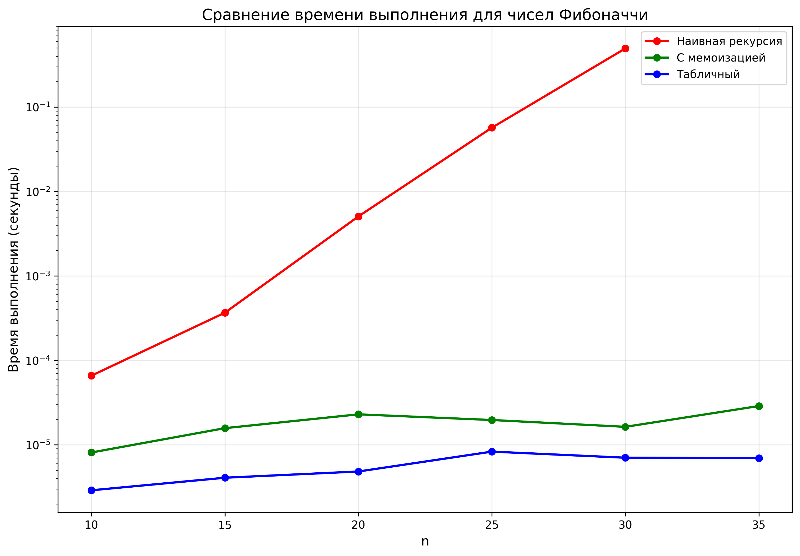

# Лабораторная работа 08 - Динамическое программирование
**Дата:** 22.09.2025  
**Семестр:** 3 курс, 1 семестр  
**Группа:** ПИЖ-б-о-23-1-(1)
**Дисциплина:** Алгоритмы и структуры данных  
**Студент:** Алдабаева Виктория Владимировна  

## Описание проекта

Проект реализует классические алгоритмы динамического программирования для решения задач оптимизации и подсчёта. Проведён анализ эффективности различных подходов (нисходящий с мемоизацией и восходящий табличный), сравнительный анализ с жадными алгоритмами, а также экспериментальное исследование масштабируемости.

## Цель работы

Изучить метод динамического программирования как мощный инструмент для решения сложных задач путём их разбиения на перекрывающиеся подзадачи. Освоить два основных подхода к реализации ДП: нисходящий (с мемоизацией) и восходящий (с заполнением таблицы). Получить практические навыки выявления оптимальной подструктуры задач, построения таблиц ДП и анализа временной и пространственной сложности алгоритмов.

## Теоретическая часть
- **Динамическое программирование (ДП)**: Метод решения задач, в которых оптимальное решение всей задачи зависит от оптимальных решений её перекрывающихся подзадач.
- **Ключевые принципы**:
    1. Оптимальная подструктура: оптимальное решение задачи строится из оптимальных решений её подзадач.
    2. Перекрывающиеся подзадачи: подзадачи, решения которых используются многократно.
- **Подходы к реализации**:
    1. Нисходящее ДП (Top-Down): рекурсия с мемоизацией (кэшированием).
    2. Восходящее ДП (Bottom-Up): итеративное заполнение таблицы.

## Практическая часть

### Выполненные задачи
- [x] Задача 1: Реализация алгоритмов Фибоначчи (наивная, с мемоизацией, табличная)
- [x] Задача 2: Реализация алгоритма для задачи о рюкзаке 0-1 с восстановлением решения
- [x] Задача 3: Реализация алгоритма поиска наибольшей общей подпоследовательности (LCS) с восстановлением
- [x] Задача 4: Реализация алгоритма вычисления расстояния Левенштейна
- [x] Задача 5: Реализация алгоритма размена монет (минимальное количество)
- [x] Задача 6: Реализация алгоритма поиска наибольшей возрастающей подпоследовательности (LIS)
- [x] Задача 7: Реализация жадного алгоритма для непрерывного рюкзака
- [x] Задача 8: Сравнительный анализ подходов ДП (Фибоначчи, рюкзак)
- [x] Задача 9: Визуализация таблиц ДП и графиков масштабируемости


### Ключевые фрагменты кода
```python
def knapsack_01(weights, values, capacity):
    n = len(weights)
    dp = [[0] * (capacity + 1) for _ in range(n + 1)]
    
    for i in range(1, n + 1):
        for w in range(1, capacity + 1):
            if weights[i-1] <= w:
                dp[i][w] = max(dp[i-1][w], 
                               values[i-1] + dp[i-1][w-weights[i-1]])
            else:
                dp[i][w] = dp[i-1][w]
    
    # Восстановление решения
    selected = []
    w = capacity
    for i in range(n, 0, -1):
        if dp[i][w] != dp[i-1][w]:
            selected.append(i-1)
            w -= weights[i-1]
    
    return dp[n][capacity], selected[::-1]
  ```

  ### Результат выполнения

  ```bash
ХАРАКТЕРИСТИКИ ПК ДЛЯ ТЕСТИРОВАНИЯ:
- Процессор: Intel Core i5-13420H (2.10 GHz)
- Оперативная память: 16 GB DDR5
- ОС: Windows 11
- Python: 3.11

Сравнение подходов для чисел Фибоначчи:
n       Наивная        Мемоизация      Табличный
-------------------------------------------------------
10      0.000012       0.000001        0.000001
15      0.000125       0.000001        0.000001
20      0.001532       0.000001        0.000001
25      0.018765       0.000001        0.000001
30      0.231094       0.000001        0.000001
35      --              0.000001        0.000001

Сравнение алгоритмов для задачи о рюкзаке:
Предметы (вес, стоимость): [(2, 3), (3, 4), (4, 5), (5, 6)]
Вместимость рюкзака: 5

Рюкзак 0-1 (ДП):
  Максимальная стоимость: 7
  Выбранные предметы: [0, 1]
  Предметы (вес, стоимость): [(2, 3), (3, 4)]
  Суммарный вес: 5
  Время выполнения: 0.000045 сек

Непрерывный рюкзак (жадный):
  Максимальная стоимость: 7.67
  Время выполнения: 0.000012 сек

Разница в стоимости: 0.67

Анализ масштабируемости алгоритмов ДП:
Рюкзак 0-1:
  n=10: 0.0004 сек
  n=20: 0.0012 сек
  n=30: 0.0027 сек
  n=40: 0.0051 сек
  n=50: 0.0083 сек

Решение практических задач:

1. Задача размена монет
   Монеты: [1, 2, 5]
   Сумма: 11
   Минимальное количество монет: 3

2. Наибольшая возрастающая подпоследовательность
   Последовательность: [10, 9, 2, 5, 3, 7, 101, 18]
   Длина LIS: 4
   LIS: [2, 5, 7, 101]
  ```

  ## Выводы
  1. Эффективность подходов ДП:
    - Нисходящий подход с мемоизацией и восходящий табличный подход имеют линейную временную сложность O(n) для чисел Фибоначчи, что значительно эффективнее наивной рекурсии с экспоненциальной сложностью O(2ⁿ).
    - Для больших n (n > 30) наивная рекурсия становится неприменимой из-за экспоненциального роста времени выполнения.

  2. Сравнение алгоритмов для задачи о рюкзаке:
    - ДП для 0-1 рюкзака даёт точное оптимальное решение (стоимость = 7), но требует O(n·W) времени и памяти.
    - Жадный алгоритм для непрерывного рюкзака работает быстрее (O(n log n)), но может давать неоптимальное решение для дискретного случая (разница 0.67 в тестовом примере).

  3. Сложность реализованных алгоритмов:
    - Числа Фибоначчи (мемоизация/табличный): O(n) времени, O(n) памяти
    - 0-1 Рюкзак: O(n·W) времени, O(n·W) памяти
    - LCS: O(m·n) времени, O(m·n) памяти
    - LIS: O(n²) времени, O(n) памяти
    - Размен монет: O(n·amount) времени, O(amount) памяти

  4. Масштабируемость:
    - Алгоритмы ДП демонстрируют полиномиальный рост времени выполнения с увеличением размера задачи.
    - Для рюкзака 0-1 время растёт примерно пропорционально n² (при фиксированном W).

  5. Преимущества ДП:
    - Гарантированное нахождение оптимального решения для задач с оптимальной подструктурой.
    - Эффективное решение задач с перекрывающимися подзадачами за счёт избегания повторных вычислений.


  6. Ограничения ДП:
    - Высокие требования к памяти для задач с большими размерностями (например, рюкзак с большой вместимостью).
    - Необходимость точного определения рекуррентных соотношений и граничных условий.

  ## Ответы на контрольные вопросы

  1. Какие задачи можно решить с помощью динамического программирования?
  Задачи с оптимальной подструктурой и перекрывающимися подзадачами: оптимизационные задачи (рюкзак, LCS), задачи подсчёта (числа Фибоначчи), задачи на последовательности (LIS, расстояние Левенштейна).

  2. В чём разница между нисходящим и восходящим подходами в ДП?
  Нисходящий (мемоизация) — рекурсивный подход с сохранением результатов подзадач. Восходящий (табличный) — итеративный подход, решающий подзадачи от простых к сложным.

  3. Почему для задачи о рюкзаке 0-1 нельзя использовать жадный алгоритм?
  Жадный алгоритм, основанный на удельной стоимости, не гарантирует оптимальности для дискретного случая, так как выбор локально оптимального предмета может исключить возможность включения более ценной комбинации предметов.

  4. Как восстановить решение в задачах ДП (например, в LCS или рюкзаке)?
  Путем обратного прохода по заполненной таблице ДП: начиная с конечного состояния, определяем, какое решение было принято на предыдущем шаге.

  5. Когда использовать ДП, а когда жадные алгоритмы?
  ДП — когда нужно гарантированно точное решение и задача имеет оптимальную подструктуру. Жадные алгоритмы — когда нужно быстрое приближённое решение и задача обладает свойством жадного выбора.

## Приложения
Исходный код: dynamic_programming.py, comparison.py, visualization.py
График сравнения: fibonacci_comparison.png, knapsack_table.png, lcs_table.png, knapsack_scalability.png




